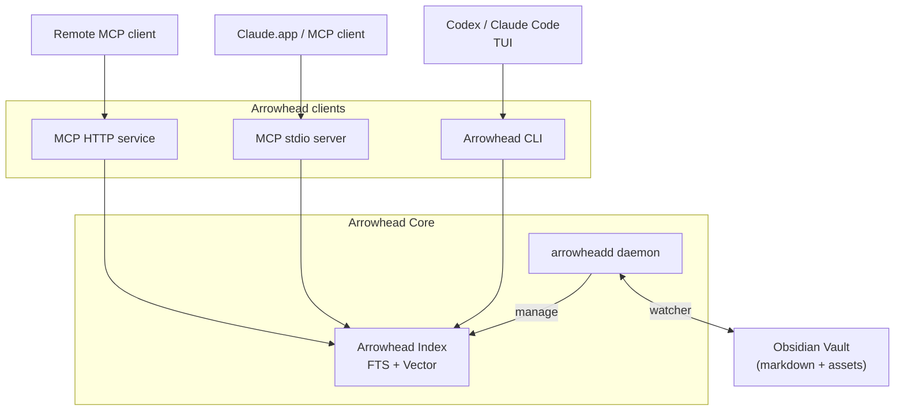

<picture>
  <source media="(prefers-color-scheme: dark)" srcset="docs/assets/github-logo-dark.png">
  <source media="(prefers-color-scheme: light)" srcset="docs/assets/github-logo-light.png">
  
</picture>

**Fast Obsidian search and discovery that makes AI agents your true knowledge assistant.**

Arrowhead is a cross-platform CLI and daemon that keeps your Obsidian vault indexed around the clock. It combines fast full-text search, semantic vectors, graph analytics, and a Claude-ready MCP interface so both humans and agents can explore your notes without friction.

## How It Works



The Arrowhead Core runtime watches your vault, streams changes into a bounded writer queue, and persists both text and vector indexes without taking ownership of your files. Arrowhead clients—the CLI and the MCP transports—sit on top of that runtime, reading directly from the shared index to serve both local workflows and remote agent requests.

## Features

- Background daemon with live filesystem watching and bounded persistence queue.
- Vault-aware indexing that respects `.obsidian` settings, templates, and ignore lists.
- Generic Markdown workspace support via `.arrowhead/workspace.toml`, with automatic fallbacks to Obsidian settings when present.
- Full-text, semantic, and hybrid search with snippet generation and metadata filters.
- Notes CRUD, graph analytics, and discovery helpers via CLI or MCP tool surface.
- HTTP MCP transport with bearer/link-token authentication, CIDR allowlists, and `/health` readiness probes.
- Semantic embeddings using fastembed with vectors stored in sqlite-vec alongside the primary index.
- Auto-start manifests for macOS (launchd) and Linux (`systemd --user`) with CLI management.

## Quick Start

#### 1. Install Arrowhead.

```bash
brew tap totocaster/tap
brew install totocaster/tap/arrowhead
```

#### 2. Navigate to your Obsidian vault and initialize Arrowhead.

```
arrowhead init
```

This command launches and registers the indexer, which watches your files and keeps the index ready to use. Initial indexing might take some time depending on your vault size; run `arrowhead index status` to monitor progress.

When you initialise a non-Obsidian workspace, Arrowhead writes `.arrowhead/workspace.toml` to capture attachments, ignored folders, daily note format, and preferred link style. Use flags such as `--attachments-dir`, `--ignore`, `--daily-note-format`, and `--link-style` during `arrowhead init` to pre-populate those values; Obsidian vaults continue to pull the same data from `.obsidian`. You can inspect or tweak these settings later with `arrowhead workspace show` and `arrowhead workspace set`.

#### 3. Start using Arrowhead.

* CLI: Use the CLI when working with coding agents that have terminal access (Claude Code, Codex CLI) for the best performance.
* MCP: Use the MCP client for local or remote AI agent instances such as Claude.app. 

To configure a local MCP client, add this snippet:

```json
{
  "mcpServers": {
    "arrowhead": {
      "command": "arrowhead",
      "args": ["--mcp"]
    }
  }
}
```

For remote or headerless clients, launch the HTTP transport instead (keep
Arrowhead bound to localhost and put a TLS reverse proxy—or a zero-config mesh
like Tailscale—in front if you expose it beyond your machine):

```bash
# Generate a new token (digest stored in config, raw token printed once)
arrowhead --mcp-server --generate-token

# Start the server on an explicit bind address, allowing a CIDR range
arrowhead --mcp-server --bind 0.0.0.0:3911 --allow 10.0.0.0/8 --token $ARROWHEAD_TOKEN
```

The server enforces bearer headers by default. In link-token mode
(`--auth-mode link-token`) clients without header support can call
`POST /rpc/<token>`; combine with HTTPS via a reverse proxy for production.

## Workspace configuration

Arrowhead still prefers `.obsidian` metadata when it exists, but any plain Markdown directory can be configured by editing `.arrowhead/workspace.toml`. The file stores the same levers we usually read from Obsidian:

- `attachments_dir`: relative folder where binary assets live.
- `ignored_folders`: directories that should be skipped during indexing.
- `daily_note_format`: file-name template for daily notes (e.g., `YYYY-MM-DD`).
- `link_style`: preferred link behaviour (e.g., `relative`, `absolute`, `shortest`).

Running `arrowhead init --attachments-dir Assets --ignore Drafts --daily-note-format "YYYY-MM-DD"` populates these values automatically. Later adjustments don’t require a destructive re-initialisation—use `arrowhead workspace set --ignore Drafts --ignore Private` (and optional `--clear-*` flags) to update the TOML in place. If both `.obsidian` and `.arrowhead/workspace.toml` exist, Arrowhead logs a warning and sticks with the Obsidian settings so you always match what the editor expects.

### Memory footprint

The daemon keeps semantic search ready by loading the `fastembed` model into an embedding pool sized to your CPU count (up to eight concurrent model handles). Each handle pulls the ~90 MB ONNX weights plus ONNX Runtime state, so full semantic mode typically consumes around 1 GB of RAM even when idle.  
If you only need full-text indexing or want a lighter runtime, disable embeddings:

```bash
# Initialize the vault without semantic embeddings
arrowhead init --fts-only

# Or launch manually with embeddings disabled
ARROWHEAD_EMBEDDING_MODEL=none arrowhead index start
```

This keeps FTS indexing and search working while skipping the model downloads and heap allocations that normally dominate the daemon's memory footprint.

## Architecture

```
arrowhead/
├── crates/
│   ├── arrowhead-core/     # Vault I/O, indexer engine, search & graph primitives
│   ├── arrowhead-daemon/   # Background runtime (watcher, queue, control socket, binary)
│   ├── arrowhead-mcp/      # MCP protocol (stdio runtime, handlers, tooling)
│   └── arrowhead-cli/      # CLI (clap commands, config, runtime bootstrap)
├── docs/                   # Specs, protocol references, development guides
└── tests/                  # Integration harness and fixture vaults
```

### Library Surface

- `arrowhead-core` exposes vault discovery, indexing, embeddings, search, and graph primitives (`Vault`, `Indexer`, `SearchService`, `GraphService`, etc.).
- `arrowhead-mcp` implements the stdio and HTTP transports plus shared tool handlers.
- `arrowhead-cli` wraps the runtime with `clap` commands under `crates/arrowhead-cli/src/commands/`.
- All public crates use `anyhow::Result<T>` for fallible operations and share data types via `arrowhead_core::types`.

## Technology Stack

- **Language**: Rust 1.86 (2024 edition) with `anyhow`/`thiserror` for rich errors.
- **CLI**: `clap` 4.5+, `tracing` for structured diagnostics.
- **Daemon runtime**: `tokio` 1.40+ with `notify`-backed filesystem watching.
- **Database**: SQLite (`rusqlite`) with FTS5 and JSON metadata columns.
- **Vectors**: `fastembed` embeddings persisted via sqlite-vec inside the SQLite index.
- **MCP**: Standards-compliant stdio and Axum-based HTTP transports with shared request handlers.

## Building

```bash
# Build all crates
cargo build

# Build release version
cargo build --release

# Install CLI + daemon (installs `arrowhead` + `arrowheadd`)
make install PREFIX=$HOME/.local LOCKED=0 FORCE=1

# Run CLI
arrowhead --help

# Run tests
cargo test
```

## Usage overview

```bash
# Initialize a vault (creates .arrowhead/, prepares index DB, offers auto-start)
arrowhead init --vault /path/to/vault [--embeddings fast|good|better|none] [--fts-only]
# (Subsequent commands reuse the stored vault path.)

# Launch or check the background indexer
arrowhead index start
arrowhead index status
# Interactive TUI output; add --json for machine-readable frames.

# Manage auto-start registration (per-user launchd/systemd)
arrowhead index autostart enable
arrowhead index autostart status
arrowhead index autostart disable

# Search (FTS, semantic, or hybrid)
arrowhead search fts "project roadmap"
arrowhead search semantic "notes about embeddings"
arrowhead search hybrid "mixed query"

# Pipe-friendly search output
arrowhead search fts "project roadmap" --format paths
arrowhead search semantic "notes about embeddings" --format ids

For boolean syntax, field scoping, and date filters, see [`docs/query_syntax.md`](docs/query_syntax.md).

# Graph pipelines
arrowhead graph orphans --format ids | head -20
arrowhead graph backlinks "Project Hub" --format ids

# CRUD helpers + graph analytics
arrowhead notes list --json
arrowhead graph context "Project Hub"
# Discovery helpers
arrowhead notes similar "Photography Equipment"
arrowhead notes surprise "Project Hub" --limit 3 --json

# Tail structured logs
tail -f /path/to/vault/.arrowhead/logs/cli.log
tail -f /path/to/vault/.arrowhead/logs/daemon.log

# Stop the indexer or clean up Arrowhead artifacts
arrowhead index stop
arrowhead vault reset

# Run the MCP stdio server for Claude or other clients
arrowhead --mcp

# Launch the HTTP MCP transport (bearer auth by default)
arrowhead --mcp-server --bind 127.0.0.1:3911 --token $ARROWHEAD_TOKEN

# Run with a Tailscale funnel (after enabling funnel for your node)
tailscale serve https / http://127.0.0.1:3911

# Generate a token (digest persisted, token printed once)
arrowhead --mcp-server --generate-token
```

Semantic-only matches surface `"N/A"` in the BM25 column of the human-readable output to clarify that no lexical score is available. Graph listings pick up the same pipe-friendly `--format ids` option for backlinks, forward-links, orphans, and unresolved link reports.

## Alfred Workflow Integration

- Preferred install: download the latest `arrowhead-search-<version>.alfredworkflow` from the [GitHub Releases](https://github.com/totocaster/arrowhead/releases) page and double-click to import it into Alfred.
- Source files live under `integrations/alfred-workflow/`. Run `make alfred-workflow` to regenerate `workflow/arrowhead-search.alfredworkflow`; the packaging script syncs the bundle version with the workspace version.
- Script Filter: `/usr/bin/python3 src/search.py` invokes `arrowhead search <mode> "<query>" --json --include-paths` (default limit 15) and maps the JSON payload (`note_id`, `relative_path`, `absolute_path`, `preview`, `reason`) into Alfred items. The CLI path is auto-discovered across common install locations (`~/.local/bin`, Homebrew, `/usr/local/bin`, etc.) before surfacing an error.
- Run Script: `/usr/bin/python3 src/open_note.py` opens results in Obsidian by default; holding ⌘ routes to the macOS default editor (or a custom command configured via workflow variables).
- Ensure the Arrowhead daemon is running before triggering searches. The workflow shells out to `arrowhead search <mode> --json` and opens notes in Obsidian by default (hold ⌘ to switch to the macOS default editor).

## CLI Reference

- `arrowhead init` — bootstrap a vault, seed configuration, and offer auto-start registration when requested.
- `arrowhead index <subcommand>` — manage the background indexer (`start`, `stop`, `restart`, `status`, `autostart`).
- `arrowhead vault <subcommand>` — inspect filesystem state or reset Arrowhead caches (`status`, `reset`).
- `arrowhead search` — execute FTS, semantic, or hybrid searches with pipe-friendly output formats.
- `arrowhead notes` — perform note CRUD operations, metadata inspection, and semantic discovery (`notes similar` / `notes surprise`).
- `arrowhead graph` — inspect backlinks, forward links, orphans, unresolved links, or combined context views (`--json` emits machine-readable payloads).
- `arrowhead --mcp[(-server)]` — launch the stdio or HTTP MCP transport with shared handlers, token auth, CIDR filtering, and `/health` readiness probes.

### MCP transport options

- `--bind <ADDR>` overrides the default bind address (`127.0.0.1:3911`); `ARROWHEAD_MCP_BIND` mirrors the flag.
- `--auth-mode <bearer|link-token>` switches between header-based and path-embedded tokens.
- `--token`, `--token-file`, `--token-hash` supply raw or hashed credentials; `ARROWHEAD_MCP_TOKEN` adds a raw token from the environment.
- `--allow` / `--allow-file` append CIDR ranges to the default localhost allowlist.
- `--generate-token` mints a random token, persists its digest, prints usage snippets, then exits.

## MCP Tool Surface

- After initialization, call `mcp.discovery.get_vault_conventions` so agents load vault naming rules, metadata expectations, and the bundled playbook before mutating notes.
- Graph: `mcp.graph.get_context`, `mcp.graph.get_backlinks`, `mcp.graph.get_forward_links`, `mcp.graph.find_orphans`, `mcp.graph.find_unresolved`
- Search: `mcp.search.fts`, `mcp.search.semantic`, `mcp.search.hybrid`
- Notes: `mcp.notes.list`, `mcp.notes.read`, `mcp.notes.metadata`, `mcp.notes.create`, `mcp.notes.update`, `mcp.notes.delete`
- Discovery: `mcp.discovery.get_related_notes`, `mcp.discovery.get_vault_stats`, `mcp.discovery.get_vault_conventions`
- Vault: `mcp.vault.status`
- Protocol: `mcp.protocol.initialize`, `mcp.protocol.tools/list`

Semantic and hybrid tools require embeddings; discovery fallbacks lean on graph heuristics when embeddings are disabled. Place vault-level guidance in `ARROWHEAD.md` at the root—the conventions tool returns its contents alongside the bundled `AGENTS.md` playbook so Claude/Codex agents inherit both global instructions and vault-specific preferences.

## MCP Protocol Details

### Transport modes

- **stdio (`arrowhead --mcp`)**: newline-delimited JSON-RPC 2.0 over stdin/stdout with a bounded request queue (64 pending by default). When the queue or worker pool is saturated the server returns a `RateLimited` error and logs summary metrics on shutdown.
- **HTTP (`arrowhead --mcp-server`)**: JSON-RPC 2.0 on `POST /rpc` with identical handler logic, request limits, and error mapping; malformed JSON produces `400`, authentication failures produce `401`/`403`, and backpressure surfaces as HTTP 429. `GET /health` offers a readiness probe.

Both transports share the handlers defined in `crates/arrowhead-mcp`, so behaviour is consistent regardless of client wiring.

### Authentication & network policy

- Tokens are hashed with SHA-256 before persistence; raw strings never touch disk or logs.
- Bearer mode (default) expects `Authorization: Bearer <token>` headers; link-token mode accepts `/rpc/<token>` paths while still honouring bearer headers. Prefer HTTPS when using link-token to keep credentials out of plaintext URLs.
- `--generate-token` prints a one-time secret and stores only the digest; record the raw value immediately.
- The HTTP transport allows only localhost traffic by default (`127.0.0.0/8`, `::1/128`). Extend access with `--allow`, `--allow-file`, or corresponding config entries so that non-local clients are admitted intentionally.

### Example request

```json
{"jsonrpc":"2.0","id":1,"method":"mcp.notes.create","params":{"title":"Projects/Test Plan","content":"# Test Plan"}}
```

```json
{"jsonrpc":"2.0","id":1,"result":{"noteId":"Projects/Test Plan","title":"Projects/Test Plan","metadata":{"title":"Projects/Test Plan"},"content":"# Test Plan","relativePath":"Projects/Test Plan.md","fileModifiedAt":"2024-01-18T08:53:00Z"}}
```

### Reverse proxy guidance

Terminate TLS in a reverse proxy (nginx, Caddy, Traefik, Cloudflare Tunnel, Tailscale Funnel, etc.) and forward traffic to the loopback-bound MCP server. A minimal nginx snippet:

```
server {
    listen 443 ssl http2;
    server_name arrowhead.example.com;

    ssl_certificate     /etc/letsencrypt/live/arrowhead.example.com/fullchain.pem;
    ssl_certificate_key /etc/letsencrypt/live/arrowhead.example.com/privkey.pem;

    location / {
        proxy_pass       http://127.0.0.1:3911;
        proxy_set_header Host              $host;
        proxy_set_header X-Real-IP         $remote_addr;
        proxy_set_header X-Forwarded-For   $proxy_add_x_forwarded_for;
        proxy_set_header X-Forwarded-Proto https;
    }
}
```

Keep the Arrowhead allowlist scoped to loopback so all external traffic is funneled through the proxy. Layer OAuth/OIDC (e.g., oauth2-proxy, Cloudflare Access) in front when you need user-facing authentication.

## Roadmap

Active roadmap items are tracked on GitHub and currently include:

- Adding MCP transport metrics with TLS/reverse-proxy guidance.
- Expanding graph diagnostics for large vaults.
- Hardening semantic and hybrid search scoring.
- Improving embedding model management UX.
- Tracking sqlite-vec dependency health and minimum supported Rust version updates.

## Release Process

- Tag the commit you want to ship with `vX.Y.Z`; pushing the tag triggers the `Release` workflow.
- The workflow re-runs formatting, clippy, and tests on Ubuntu, then builds macOS Intel (macos-12) and Apple Silicon (macos-14) binaries with `cargo build --release`.
- Binaries are packaged as `arrowhead-<version>-<target>.tar.gz` with `bin/arrowhead` plus the project README and uploaded to the GitHub release.
- Set a personal access token with `repo` scope as the `HOMEBREW_TAP_TOKEN` repository secret so the workflow can push tap updates to `totocaster/homebrew-tap`.
- The tap formula is rewritten automatically to point at the new release URLs and SHA256 sums for both macOS architectures.

## License

Distributed under the MIT License. See [`LICENSE`](LICENSE) for details.

## Contributing

We welcome issues and pull requests once the Arrowhead foundation is fully stabilized. Start by reading this README and the [feature development guide](docs/feature_development_guide.md). Make sure `cargo fmt`, `cargo clippy`, `cargo check`, and `cargo test` pass before submitting changes.

## Acknowledgments

Arrowhead is the Rust rewrite of [Synapse-Obsidian](https://github.com/totocaster/Synapse-Obsidian), originally a macOS Swift app. Huge thanks to the early users and contributors whose feedback shaped the new CLI-first architecture.
