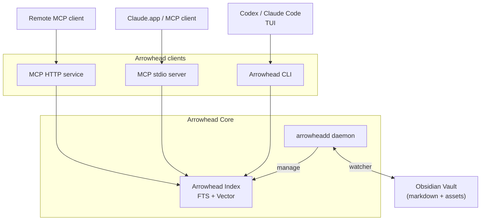

<picture>
  <source media="(prefers-color-scheme: dark)" srcset="docs/assets/github-logo-dark.png">
  <source media="(prefers-color-scheme: light)" srcset="docs/assets/github-logo-light.png">
  
</picture>

**Fast Obsidian search and discovery that makes AI agents your true knowledge assistant.**

Arrowhead is a cross-platform CLI and daemon that keeps your Obsidian vault indexed around the clock. It combines fast full-text search, semantic vectors, graph analytics, and a Claude-ready MCP interface so both humans and agents can explore your notes without friction.

## How It Works



Arrowhead Core runtime watches your vault, streams changes into a bounded writer queue, and persists both text and vector indexes without taking ownership of your files. Arrowhead clients—the CLI and the MCP transports—sit on top of that runtime, reading directly from the shared index to serve both local workflows and remote agent requests.

## Features

- Background daemon with live filesystem watching and bounded persistence queue.
- Vault-aware indexing that respects `.obsidian` settings, templates, and ignore lists.
- Full-text, semantic, and hybrid search with snippet generation and metadata filters.
- Notes CRUD, graph analytics, and discovery helpers via CLI or MCP tool surface.
- Semantic embeddings using fastembed with vectors stored in sqlite-vec alongside the primary index.
- Auto-start manifests for macOS (launchd) and Linux (`systemd --user`) with CLI management.

## Quick Start

#### 1. Download arrowhead.

```bash
brew install arrowhead
```

#### 2. Navigate to your Obsidian vault and initialize Arrowhead. 

```
arrowhead init
```

This will launch and register the daemon that will keep watching your files and keep the index ready for use. Initial indexing might take some time depending on the size of your vault. You can use the `arrowhead vault status` to check it.  

#### 3. Start using Arrowhead

* CLI: It is recommended to use a CLI tool when working with coding agents that have access to the terminal (Claide Code, Codex CLI) for performance reasons.
* MCP: For local remote AI agent instances such as Claude.app, use MCP client. 

To cofigure local mcp use this snippet:

```json
{
  "mcpServers": {
    "arrowhead": {
      "command": "arrowhead",
      "args": ["--mcp"]
    }
  }
}
```

### Memory footprint

The daemon keeps semantic search ready by loading the `fastembed` model into an embedding pool sized to your CPU count (up to eight concurrent model handles). Each handle pulls the ~90 MB ONNX weights plus ONNX Runtime state, so full semantic mode typically consumes around 1 GB of RAM even when idle.  
If you only need full-text indexing or want a lighter runtime, disable embeddings:

```bash
# Initialise the vault without semantic embeddings
arrowhead init --fts-only

# Or launch manually with embeddings disabled
ARROWHEAD_EMBEDDING_MODEL=none arrowhead vault start
```

This keeps FTS indexing and search working while skipping the model downloads and heap allocations that normally dominate the daemon’s memory footprint.

## Architecture

```
arrowhead/
├── crates/
│   ├── arrowhead-core/     # Vault I/O, indexer engine, search & graph primitives
│   ├── arrowhead-deamon/   # Background runtime (watcher, queue, control socket, binary)
│   ├── arrowhead-mcp/      # MCP protocol (stdio runtime, handlers, tooling)
│   └── arrowhead-cli/      # CLI (clap commands, config, runtime bootstrap)
├── docs/                   # Specs, protocol references, development guides
└── tests/                  # Integration harness and fixture vaults
```

## Technology Stack

- **Language**: Rust 1.86 (2024 edition) with `anyhow`/`thiserror` for rich errors.
- **CLI**: `clap` 4.5+, `tracing` for structured diagnostics.
- **Daemon runtime**: `tokio` 1.40+ with `notify`-backed filesystem watching.
- **Database**: SQLite (`rusqlite`) with FTS5 and JSON metadata columns.
- **Vectors**: `fastembed` embeddings persisted via sqlite-vec inside the SQLite index.
- **MCP**: Standards-compliant stdio transport; HTTP transport under active development.

## Building

```bash
# Build all crates
cargo build

# Build release version
cargo build --release

# Install CLI + daemon (installs `arrowhead` + `arrowheadd`)
make install PREFIX=$HOME/.local LOCKED=0 FORCE=1

# Run CLI
arrowhead --help

# Run tests
cargo test
```

## Usage overview

```bash
# Initialise a vault (creates .arrowhead/, prepares index DB, offers auto-start)
arrowhead init --vault /path/to/vault [--embeddings fast|good|better|none] [--fts-only]

# Launch or check the background daemon
arrowhead vault start
arrowhead vault status

# Manage auto-start registration (per-user launchd/systemd)
arrowhead vault autostart enable
arrowhead vault autostart status
arrowhead vault autostart disable

# Search (FTS, semantic, or hybrid)
arrowhead search fts "project roadmap" --vault /path/to/vault
arrowhead search semantic "notes about embeddings" --vault /path/to/vault
arrowhead search hybrid "mixed query" --vault /path/to/vault

# Pipe-friendly search output
arrowhead search fts "project roadmap" --vault /path/to/vault --format paths
arrowhead search semantic "notes about embeddings" --vault /path/to/vault --format ids

# Graph pipelines
arrowhead graph orphans --vault /path/to/vault --format ids | head -20
arrowhead graph backlinks "Project Hub" --vault /path/to/vault --format ids

# CRUD helpers + graph analytics
arrowhead notes list --vault /path/to/vault --json
arrowhead graph context "Project Hub" --vault /path/to/vault

# Tail structured logs
tail -f /path/to/vault/.arrowhead/logs/cli.log
tail -f /path/to/vault/.arrowhead/logs/daemon.log

# Stop the daemon or clean up Arrowhead artefacts
arrowhead vault stop
arrowhead vault cleanup

# Run the MCP stdio server for Claude or other clients
arrowhead --mcp --stdio
```

Semantic-only matches surface `"N/A"` in the BM25 column of the human-readable output to clarify that no lexical score is available. Graph listings pick up the same pipe-friendly `--format ids` option for backlinks, forward-links, orphans, and unresolved link reports.

## Roadmap

- HTTP transport for MCP with bearer auth and multiplexed requests.
- Graph diagnostics: directional summaries, back-pressure metrics, large vault profiling.
- Search hardening: semantic snippet tuning, sqlite-vec regression fixtures, hybrid scoring tweaks.
- Model management UX: preset documentation, cache overrides, richer download progress.
- Vector dependency review and MSRV tracking for sqlite-vec releases.

## License

Licensed under either of:

- Apache License, Version 2.0 ([LICENSE-APACHE](LICENSE-APACHE) or http://www.apache.org/licenses/LICENSE-2.0)
- MIT license ([LICENSE-MIT](LICENSE-MIT) or http://opensource.org/licenses/MIT)

at your option.

## Contributing

We welcome issues and pull requests once the Phase 1 foundation is fully stabilised. Start by reading the [rewrite specification](docs/predev_synapse_rust_rewrite.md) and the [feature development guide](docs/feature_development_guide.md). Make sure `cargo fmt`, `cargo clippy`, `cargo check`, and `cargo test` pass before submitting changes.

## Acknowledgments

Arrowhead is the Rust rewrite of [Synapse-Obsidian](https://github.com/totocaster/Synapse-Obsidian), originally a macOS Swift app. Huge thanks to the early users and contributors whose feedback shaped the new CLI-first architecture.
