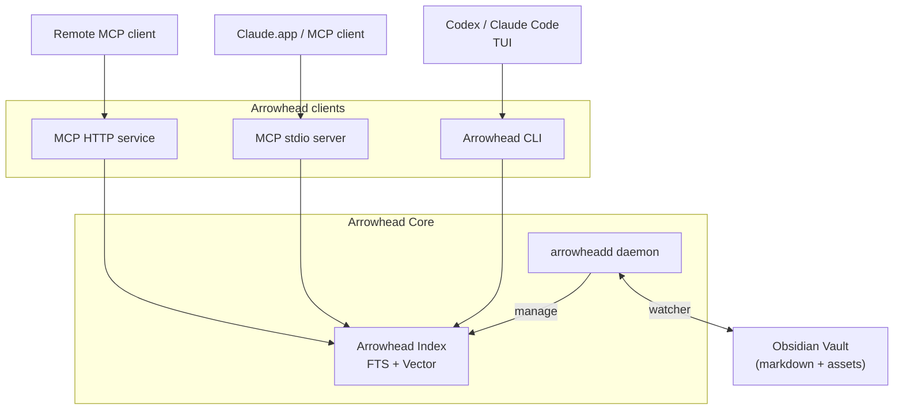

<picture>
  <source media="(prefers-color-scheme: dark)" srcset="docs/assets/github-logo-dark.png">
  <source media="(prefers-color-scheme: light)" srcset="docs/assets/github-logo-light.png">
  
</picture>

**Fast Obsidian search and discovery that makes AI agents your true knowledge assistant.**

Arrowhead is a cross-platform CLI and daemon that keeps your Obsidian vault indexed around the clock. It combines fast full-text search, semantic vectors, graph analytics, and a Claude-ready MCP interface so both humans and agents can explore your notes without friction.

## How It Works



The Arrowhead Core runtime watches your vault, streams changes into a bounded writer queue, and persists both text and vector indexes without taking ownership of your files. Arrowhead clients—the CLI and the MCP transports—sit on top of that runtime, reading directly from the shared index to serve both local workflows and remote agent requests.

## Features

- Background daemon with live filesystem watching and bounded persistence queue.
- Vault-aware indexing that respects `.obsidian` settings, templates, and ignore lists.
- Full-text, semantic, and hybrid search with snippet generation and metadata filters.
- Notes CRUD, graph analytics, and discovery helpers via CLI or MCP tool surface.
- HTTP MCP transport with bearer/link-token authentication, CIDR allowlists, and `/health` readiness probes.
- Semantic embeddings using fastembed with vectors stored in sqlite-vec alongside the primary index.
- Auto-start manifests for macOS (launchd) and Linux (`systemd --user`) with CLI management.

## Quick Start

#### 1. Install Arrowhead.

```bash
brew install arrowhead
```

#### 2. Navigate to your Obsidian vault and initialize Arrowhead.

```
arrowhead init
```

This command launches and registers the daemon, which watches your files and keeps the index ready to use. Initial indexing might take some time depending on your vault size; run `arrowhead vault status` to monitor progress.

#### 3. Start using Arrowhead.

* CLI: Use the CLI when working with coding agents that have terminal access (Claude Code, Codex CLI) for the best performance.
* MCP: Use the MCP client for local or remote AI agent instances such as Claude.app. 

To configure a local MCP client, add this snippet:

```json
{
  "mcpServers": {
    "arrowhead": {
      "command": "arrowhead",
      "args": ["--mcp"]
    }
  }
}
```

For remote or headerless clients, launch the HTTP transport instead (keep
Arrowhead bound to localhost and put a TLS reverse proxy—or a zero-config mesh
like Tailscale—in front if you expose it beyond your machine):

```bash
# Generate a new token (digest stored in config, raw token printed once)
arrowhead --mcp-server --generate-token

# Start the server on an explicit bind address, allowing a CIDR range
arrowhead --mcp-server --bind 0.0.0.0:3911 --allow 10.0.0.0/8 --token $ARROWHEAD_TOKEN
```

The server enforces bearer headers by default. In link-token mode
(`--auth-mode link-token`) clients without header support can call
`POST /rpc/<token>`; combine with HTTPS via a reverse proxy for production.

### Memory footprint

The daemon keeps semantic search ready by loading the `fastembed` model into an embedding pool sized to your CPU count (up to eight concurrent model handles). Each handle pulls the ~90 MB ONNX weights plus ONNX Runtime state, so full semantic mode typically consumes around 1 GB of RAM even when idle.  
If you only need full-text indexing or want a lighter runtime, disable embeddings:

```bash
# Initialize the vault without semantic embeddings
arrowhead init --fts-only

# Or launch manually with embeddings disabled
ARROWHEAD_EMBEDDING_MODEL=none arrowhead vault start
```

This keeps FTS indexing and search working while skipping the model downloads and heap allocations that normally dominate the daemon's memory footprint.

## Architecture

```
arrowhead/
├── crates/
│   ├── arrowhead-core/     # Vault I/O, indexer engine, search & graph primitives
│   ├── arrowhead-deamon/   # Background runtime (watcher, queue, control socket, binary)
│   ├── arrowhead-mcp/      # MCP protocol (stdio runtime, handlers, tooling)
│   └── arrowhead-cli/      # CLI (clap commands, config, runtime bootstrap)
├── docs/                   # Specs, protocol references, development guides
└── tests/                  # Integration harness and fixture vaults
```

### Library Surface

- `arrowhead-core` exposes vault discovery, indexing, embeddings, search, and graph primitives (`Vault`, `Indexer`, `SearchService`, `GraphService`, etc.).
- `arrowhead-mcp` implements the stdio and HTTP transports plus shared tool handlers.
- `arrowhead-cli` wraps the runtime with `clap` commands under `crates/arrowhead-cli/src/commands/`.
- All public crates use `anyhow::Result<T>` for fallible operations and share data types via `arrowhead_core::types`.

## Technology Stack

- **Language**: Rust 1.86 (2024 edition) with `anyhow`/`thiserror` for rich errors.
- **CLI**: `clap` 4.5+, `tracing` for structured diagnostics.
- **Daemon runtime**: `tokio` 1.40+ with `notify`-backed filesystem watching.
- **Database**: SQLite (`rusqlite`) with FTS5 and JSON metadata columns.
- **Vectors**: `fastembed` embeddings persisted via sqlite-vec inside the SQLite index.
- **MCP**: Standards-compliant stdio and Axum-based HTTP transports with shared request handlers.

## Building

```bash
# Build all crates
cargo build

# Build release version
cargo build --release

# Install CLI + daemon (installs `arrowhead` + `arrowheadd`)
make install PREFIX=$HOME/.local LOCKED=0 FORCE=1

# Run CLI
arrowhead --help

# Run tests
cargo test
```

## Usage overview

```bash
# Initialize a vault (creates .arrowhead/, prepares index DB, offers auto-start)
arrowhead init --vault /path/to/vault [--embeddings fast|good|better|none] [--fts-only]
# (Subsequent commands reuse the stored vault path.)

# Launch or check the background daemon
arrowhead vault start
arrowhead vault status

# Manage auto-start registration (per-user launchd/systemd)
arrowhead vault autostart enable
arrowhead vault autostart status
arrowhead vault autostart disable

# Search (FTS, semantic, or hybrid)
arrowhead search fts "project roadmap"
arrowhead search semantic "notes about embeddings"
arrowhead search hybrid "mixed query"

# Pipe-friendly search output
arrowhead search fts "project roadmap" --format paths
arrowhead search semantic "notes about embeddings" --format ids

# Graph pipelines
arrowhead graph orphans --format ids | head -20
arrowhead graph backlinks "Project Hub" --format ids

# CRUD helpers + graph analytics
arrowhead notes list --json
arrowhead graph context "Project Hub"

# Tail structured logs
tail -f /path/to/vault/.arrowhead/logs/cli.log
tail -f /path/to/vault/.arrowhead/logs/daemon.log

# Stop the daemon or clean up Arrowhead artifacts
arrowhead vault stop
arrowhead vault cleanup

# Run the MCP stdio server for Claude or other clients
arrowhead --mcp

# Launch the HTTP MCP transport (bearer auth by default)
arrowhead --mcp-server --bind 127.0.0.1:3911 --token $ARROWHEAD_TOKEN

# Run with a Tailscale funnel (after enabling funnel for your node)
tailscale serve https / http://127.0.0.1:3911

# Generate a token (digest persisted, token printed once)
arrowhead --mcp-server --generate-token
```

Semantic-only matches surface `"N/A"` in the BM25 column of the human-readable output to clarify that no lexical score is available. Graph listings pick up the same pipe-friendly `--format ids` option for backlinks, forward-links, orphans, and unresolved link reports.

## CLI Reference

- `arrowhead init` — bootstrap a vault, seed configuration, and enable auto-start when requested.
- `arrowhead vault <subcommand>` — manage daemon lifecycle (`start`, `status`, `stop`, `cleanup`, `autostart` helpers).
- `arrowhead search` — execute FTS, semantic, or hybrid searches with pipe-friendly output formats.
- `arrowhead notes` — perform note CRUD operations and metadata inspection.
- `arrowhead graph` — inspect backlinks, forward links, orphans, unresolved links, or combined context views (`--json` emits machine-readable payloads).
- `arrowhead --mcp[(-server)]` — launch the stdio or HTTP MCP transport with shared handlers, token auth, CIDR filtering, and `/health` readiness probes.

### MCP transport options

- `--bind <ADDR>` overrides the default bind address (`127.0.0.1:3911`); `ARROWHEAD_MCP_BIND` mirrors the flag.
- `--auth-mode <bearer|link-token>` switches between header-based and path-embedded tokens.
- `--token`, `--token-file`, `--token-hash` supply raw or hashed credentials; `ARROWHEAD_MCP_TOKEN` adds a raw token from the environment.
- `--allow` / `--allow-file` append CIDR ranges to the default localhost allowlist.
- `--generate-token` mints a random token, persists its digest, prints usage snippets, then exits.

## MCP Tool Surface

- Graph: `mcp.graph.get_context`, `mcp.graph.get_backlinks`, `mcp.graph.get_forward_links`, `mcp.graph.find_orphans`, `mcp.graph.find_unresolved`
- Search: `mcp.search.fts`, `mcp.search.semantic`, `mcp.search.hybrid`
- Notes: `mcp.notes.list`, `mcp.notes.read`, `mcp.notes.metadata`, `mcp.notes.create`, `mcp.notes.update`, `mcp.notes.delete`
- Discovery: `mcp.discovery.get_related_notes`, `mcp.discovery.get_vault_stats`, `mcp.discovery.get_vault_conventions`
- Vault: `mcp.vault.status`
- Protocol: `mcp.protocol.initialize`, `mcp.protocol.tools/list`

Semantic and hybrid tools require embeddings; discovery fallbacks lean on graph heuristics when embeddings are disabled.

## Roadmap

- MCP observability: metrics/structured tracing for the HTTP transport plus TLS/reverse-proxy guidance.
- Graph diagnostics: directional summaries, back-pressure metrics, large vault profiling.
- Search hardening: semantic snippet tuning, sqlite-vec regression fixtures, hybrid scoring tweaks.
- Model management UX: preset documentation, cache overrides, richer download progress.
- Vector dependency review and MSRV tracking for sqlite-vec releases.

## License

Licensed under either of:

- Apache License, Version 2.0 ([LICENSE-APACHE](LICENSE-APACHE) or http://www.apache.org/licenses/LICENSE-2.0)
- MIT license ([LICENSE-MIT](LICENSE-MIT) or http://opensource.org/licenses/MIT)

at your option.

## Contributing

We welcome issues and pull requests once the Phase 1 foundation is fully stabilized. Start by reading the [rewrite specification](docs/predev_synapse_rust_rewrite.md) and the [feature development guide](docs/feature_development_guide.md). Make sure `cargo fmt`, `cargo clippy`, `cargo check`, and `cargo test` pass before submitting changes.

## Acknowledgments

Arrowhead is the Rust rewrite of [Synapse-Obsidian](https://github.com/totocaster/Synapse-Obsidian), originally a macOS Swift app. Huge thanks to the early users and contributors whose feedback shaped the new CLI-first architecture.
